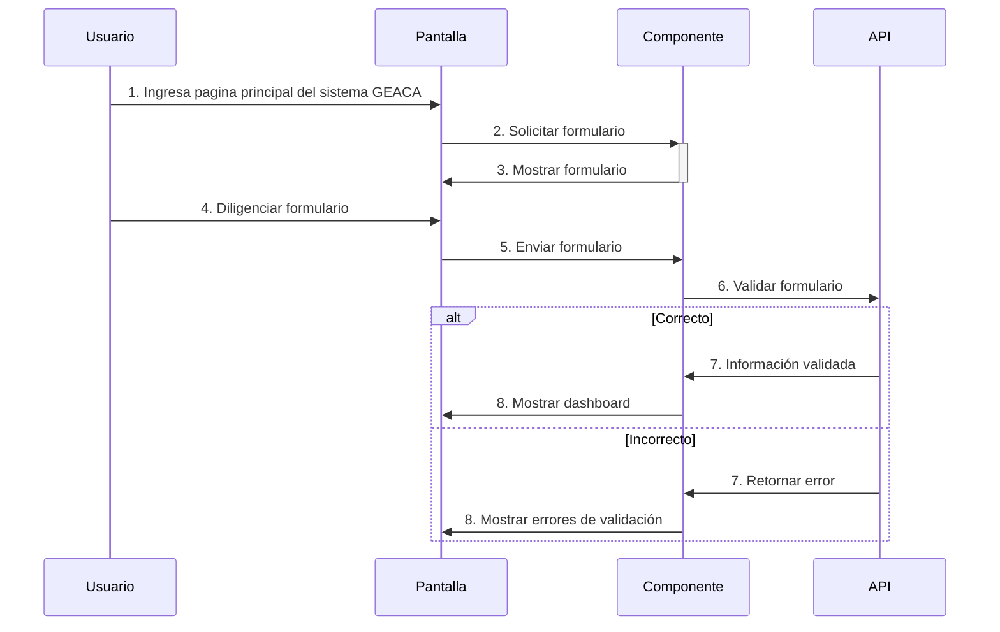
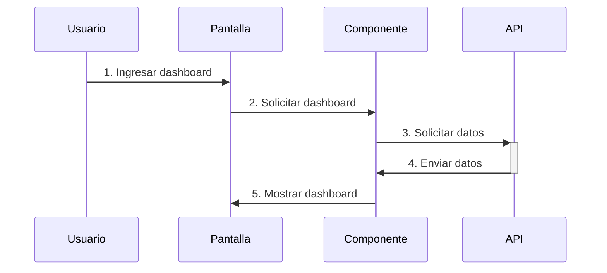
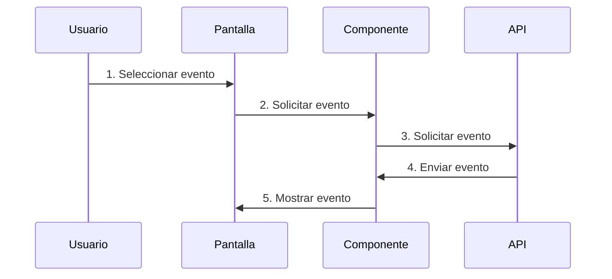
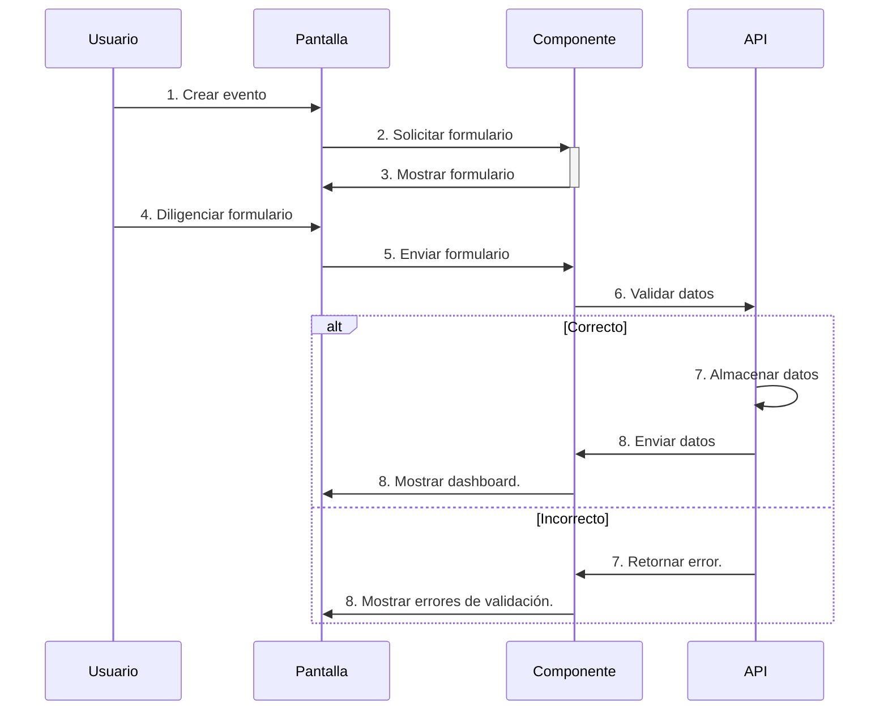
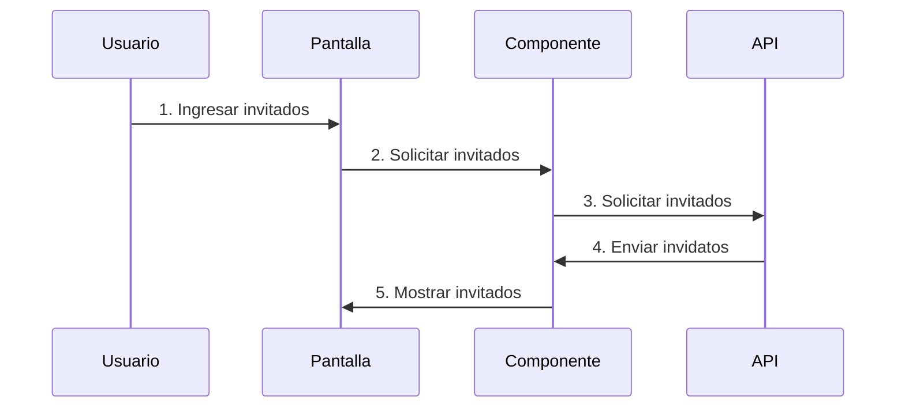
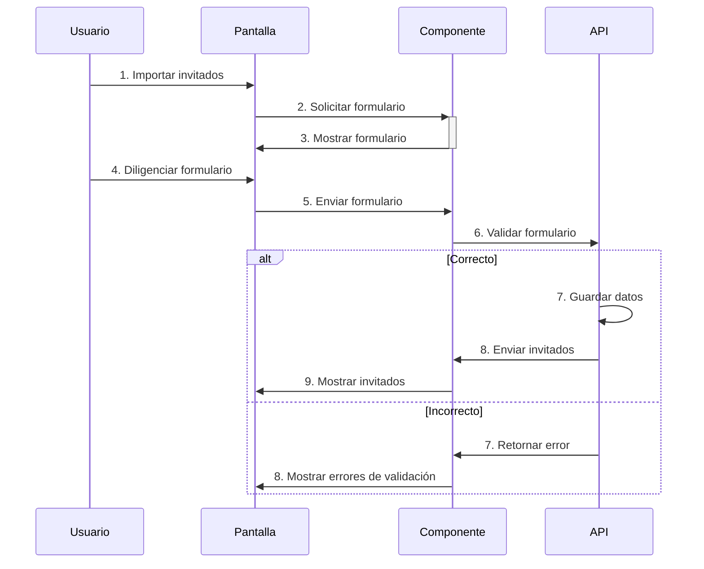
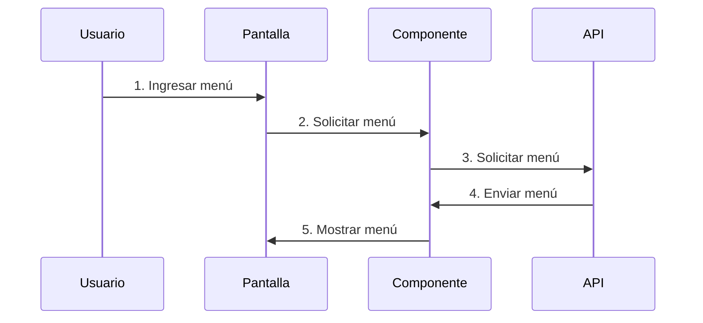
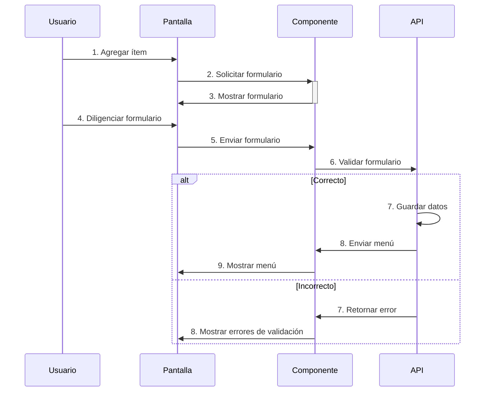
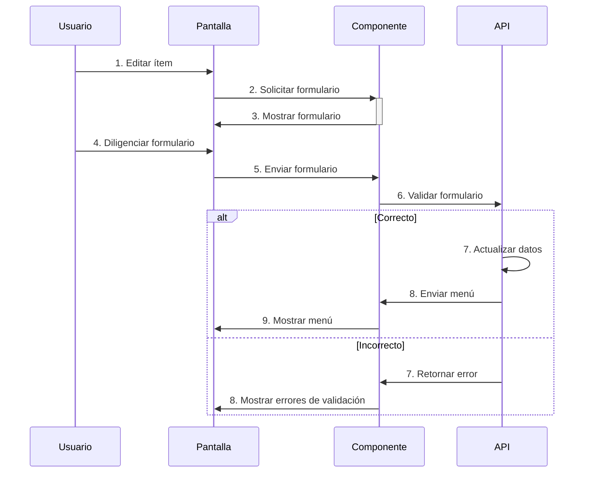

## Ingresar

## Registrarse

## Visualización de Eventos

## Ver información detallada de un evento

## Crear eventos

## Editar eventos

## Ver lista de invitados

## Agregar invitados

## Importar invitados de forma masiva

## Editar invitados

## Eliminar invitados

## Ver menú del evento

## Agregar ítems al menú del evento

## Editar ítems del menú del evento

## Eliminar ítems del menú del evento

## Editar presupuesto del evento

## Agregar distribución de sillas del evento

## Editar distribución de sillas del evento

